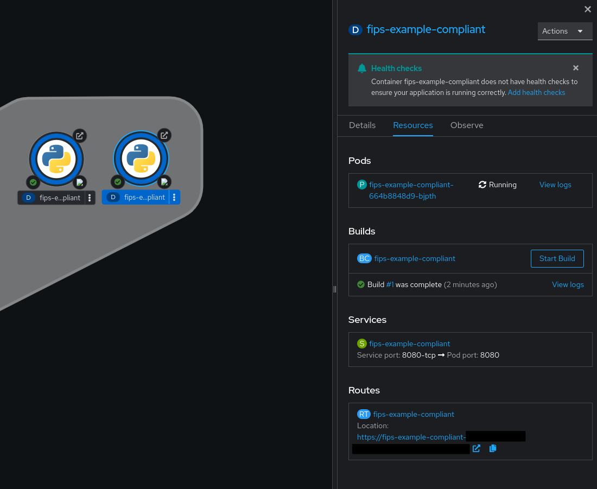
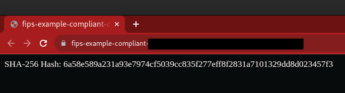
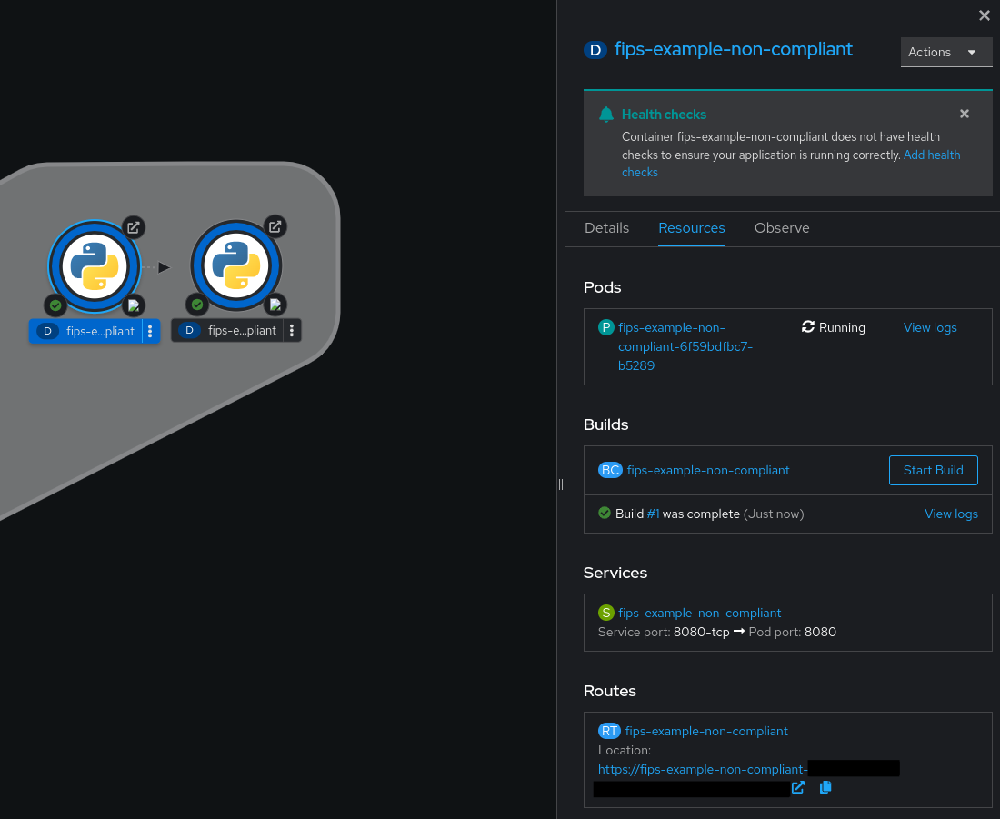
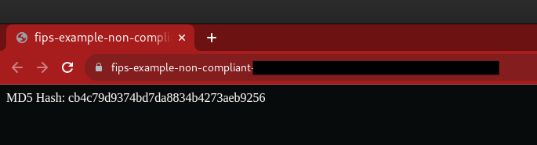
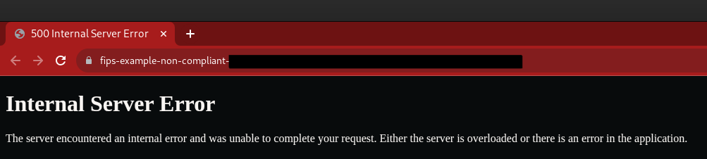

# fips-example

This repository contains examples highlighting the differences between FIPS and non-FIPS enabled containers. Both applications are simple Python Flask applications. The key difference is the inclusion of the FIPS non-compliant md5 package in the fips-non-compliant application.

There is also a client-server example that shows how a client deployed to a FIPS-enabled cluster can only communicate with a FIPS-compliant server.

## Prerequisites

- An OpenShift cluster (either FIPS-enabled or non-enabled)
- Necessary permissions to deploy applications on the cluster

## Deployment

To run the applications, follow these steps:

1. **Log in to the OpenShift Cluster**: Ensure you are logged in to a FIPS-enabled or standard OpenShift cluster.
2. **Switch to the Developer Perspective**: Navigate to the Developer perspective within the OpenShift console.
3. **Add a New Application**: Click on the +Add button and select Git Repository from the list of options.
4. **Specify Git Repository**: Enter the appropriate Git Repo URL.
5. **Specify Context Directory**: Choose either fips-non-compliant or fips-compliant as the context directory, depending on which application you would like to deploy.
6. **Create the Application**: Click on the Create button to deploy the application.

Compare the applications side by side to see the differences between FIPS and non-FIPS enabled containers.

## Standard Cluster (FIPS Disabled)

### FIPS Compliant Application

A simple FIPS-compliant application deployed to a FIPS non-compliant cluster will work out of the box, as FIPS is not actually being enforced. The application will look like the following:

With the following output (expected: a SHA256 hash):

### FIPS Non-Compliant Application

A simple FIPS-non-compliant application deployed to a FIPS non-compliant cluster will work out of the box and could look like the following:

With the following output (expected: an MD5 hash):

### FIPS Compliant Client-Server Communication

A simple FIPS-compliant application deployed to a FIPS non-compliant cluster should work out of the box, as FIPS is not being enforced. The application will look like the following:

<!--  #TODO -->

With the following output (expected: a SHA256 hash):

<!--  #TODO -->

### FIPS Non-Compliant Client-Server Communication

A simple FIPS-non-compliant application deployed to a FIPS non-compliant cluster should also work out of the box and could look like the following:

<!--  #TODO -->

With the following output (expected: an MD5 hash):

<!--  #TODO -->

## FIPS-Enabled Cluster

### FIPS Compliant Application

A simple FIPS-compliant application deployed to a FIPS-enabled cluster will continue to work as expected. The application output may look like the following:

### FIPS Non-Compliant Application

A standard FIPS-non-compliant application deployed to a FIPS-enabled cluster will fail to run the desired command, as the `MD5` package is not FIPS compliant. The application output will look like the following:

### FIPS Compliant Client-Server Communication

A simple FIPS-compliant application deployed to a FIPS-enabled cluster will continue to work as expected. The application output may look like the following:

<!--  #TODO -->

### FIPS Non-Compliant Client-Server Communication

A simple FIPS-non-compliant application deployed to a FIPS-enabled cluster should fail to run the desired command, as the cipher suite used in communication with the server is not FIPS compliant. The application output will look like the following:

<!--  #TODO -->
